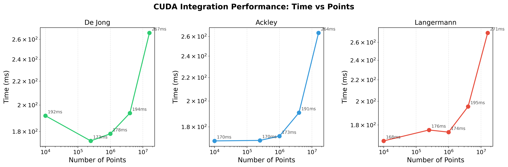
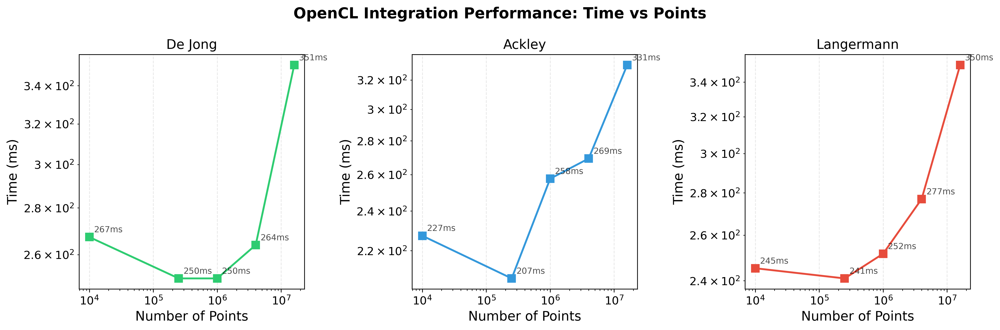
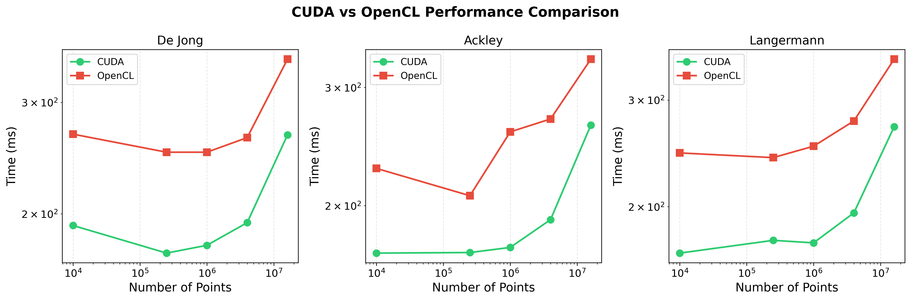
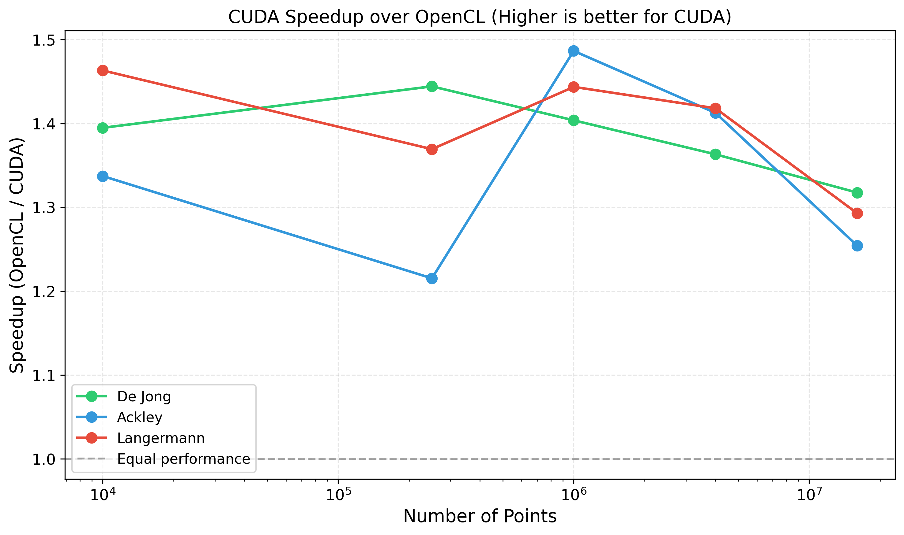
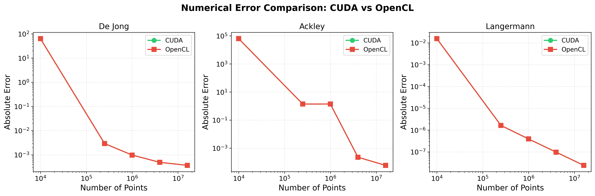
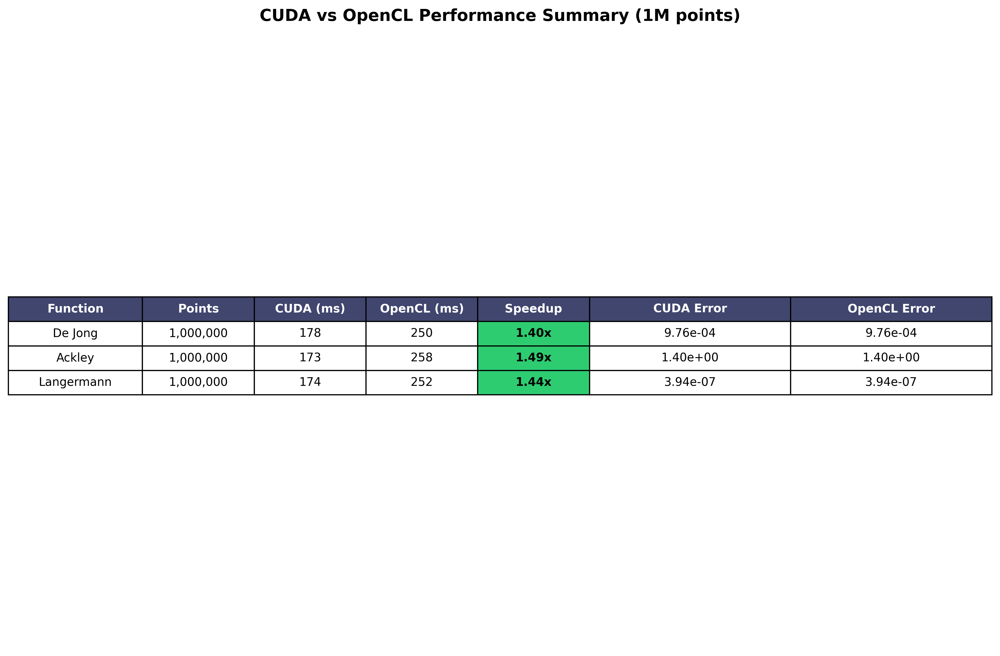

# Lab work 12. Calculation integral using CUDA, oneAPI, OpenCL
Author: [Yuliia Sova](https://github.com/JuliaSovaO)<br>

## Prerequisites

- C++ compiler with C++20 support (GCC 10+, Clang 12+, MSVC 2019+)
- NVIDIA GPU with CUDA support
- CUDA Toolkit 12.0+
- Python 3.6+ (for analysis scripts)

### Compilation

CUDA
```bash
nvcc -std=c++17 -o integrate_cuda \
    src/cuda/main_cuda.cpp \
    src/cuda/integrate_cuda.cu \
    src/config_parser/config_parser.cpp \
    -I./src \
    -I./src/config_parser \
    -I./src/cuda \
    -O3
```

OpenCL
```bash
g++ -std=c++17 -o integrate_opencl \
    src/opencl/integrate_opencl.cpp \
    src/config_parser/config_parser.cpp \
    -lOpenCL \
    -I./src \
    -I./src/config_parser \
    -O3
```

### Usage

CUDA
```bash
./integrate_cuda 1 configs/func1.cfg 1000
./integrate_cuda 2 configs/func2.cfg 1000
./integrate_cuda 3 configs/func3.cfg 1000

# run benchmark
python3 scripts/run_cuda.py --steps 100 500 1000 2000 4000 --runs 3 --output data/cuda_results.json
```

OpenCL
```bash
./integrate_opencl 1 configs/func1.cfg 1000
./integrate_opencl 2 configs/func2.cfg 1000
./integrate_opencl 3 configs/func3.cfg 1000

# run benchmark
python3 scripts/run_opencl.py --steps 100 500 1000 2000 4000 --runs 3 --output data/opencl_results.json
```
generate plots
```bash
python3 scripts/plot_results.py --cuda data/cuda_results.json --opencl data/opencl_results.json --output-dir data
```

### Important!

Program returns standard error codes:
- 0: successful execution
- 1: wrong number of arguments
- 2: wrong function index
- 3: configuration file opening error
- 5: configuration parsing error
- 16: failed to achieve desired accuracy

# Results

## Test Environment

- **CPU**: AMD Ryzen AI 9 365
- **GPU**: NVIDIA GeForce RTX 5070
- **CUDA Version**: 12.6
- **Threads per block**: 256
- **CPU Threads**: 4

## Performance Results

## Functions Tested

| ID | Name | Range | Exact Value |
|----|------|-------|-------------|
| 1 | De Jong | xє[-50,50], yє[-50,50] | 4,545,447.652 |
| 2 | Ackley | xє[-100,100], yє[-100,100] | 857,208.2414 |
| 3 | Langermann | xє[-10,10], yє[-10,10] | -1.604646665 |

## Performance Results

### CUDA Performance

#### Function 1: De Jong

| Steps | Points | Blocks | Time (ms) | Abs Error | Rel Error |
|-------|--------|--------|-----------|-----------|-----------|
| 100 | 10,000 | 40 | 192 | 6.35e+01 | 1.40e-05 |
| 500 | 250,000 | 977 | 173 | 2.93e-03 | 6.44e-10 |
| 1000 | 1,000,000 | 3,907 | 178 | 9.76e-04 | 2.15e-10 |
| 2000 | 4,000,000 | 15,625 | 194 | 4.88e-04 | 1.07e-10 |
| 4000 | 16,000,000 | 62,500 | 267 | 3.66e-04 | 8.06e-11 |

#### Function 2: Ackley

| Steps | Points | Blocks | Time (ms) | Abs Error | Rel Error |
|-------|--------|--------|-----------|-----------|-----------|
| 100 | 10,000 | 40 | 170 | 6.35e+04 | 7.41e-02 |
| 500 | 250,000 | 977 | 170 | 1.39e+00 | 1.62e-06 |
| 1000 | 1,000,000 | 3,907 | 173 | 1.40e+00 | 1.63e-06 |
| 2000 | 4,000,000 | 15,625 | 191 | 2.25e-04 | 2.63e-10 |
| 4000 | 16,000,000 | 62,500 | 264 | 5.94e-05 | 6.93e-11 |

#### Function 3: Langermann

| Steps | Points | Blocks | Time (ms) | Abs Error | Rel Error |
|-------|--------|--------|-----------|-----------|-----------|
| 100 | 10,000 | 40 | 168 | 1.56e-02 | 9.74e-03 |
| 500 | 250,000 | 977 | 176 | 1.64e-06 | 1.02e-06 |
| 1000 | 1,000,000 | 3,907 | 174 | 3.94e-07 | 2.46e-07 |
| 2000 | 4,000,000 | 15,625 | 195 | 9.75e-08 | 6.07e-08 |
| 4000 | 16,000,000 | 62,500 | 271 | 2.42e-08 | 1.51e-08 |

### OpenCL Performance

#### Function 1: De Jong

| Steps | Points | Time (ms) | Abs Error | Rel Error |
|-------|--------|-----------|-----------|-----------|
| 100 | 10,000 | 267 | 6.35e+01 | 1.40e-05 |
| 500 | 250,000 | 250 | 2.93e-03 | 6.44e-10 |
| 1000 | 1,000,000 | 250 | 9.76e-04 | 2.15e-10 |
| 2000 | 4,000,000 | 264 | 4.88e-04 | 1.07e-10 |
| 4000 | 16,000,000 | 351 | 3.66e-04 | 8.06e-11 |

#### Function 2: Ackley

| Steps | Points | Time (ms) | Abs Error | Rel Error |
|-------|--------|-----------|-----------|-----------|
| 100 | 10,000 | 227 | 6.35e+04 | 7.41e-02 |
| 500 | 250,000 | 207 | 1.39e+00 | 1.62e-06 |
| 1000 | 1,000,000 | 258 | 1.40e+00 | 1.63e-06 |
| 2000 | 4,000,000 | 269 | 2.25e-04 | 2.63e-10 |
| 4000 | 16,000,000 | 331 | 5.94e-05 | 6.93e-11 |

#### Function 3: Langermann

| Steps | Points | Time (ms) | Abs Error | Rel Error |
|-------|--------|-----------|-----------|-----------|
| 100 | 10,000 | 245 | 1.56e-02 | 9.74e-03 |
| 500 | 250,000 | 241 | 1.64e-06 | 1.02e-06 |
| 1000 | 1,000,000 | 252 | 3.94e-07 | 2.46e-07 |
| 2000 | 4,000,000 | 277 | 9.75e-08 | 6.07e-08 |
| 4000 | 16,000,000 | 350 | 2.42e-08 | 1.51e-08 |

## CUDA vs OpenCL Comparison

### Performance at 1,000,000 Points

| Function | CUDA (ms) | OpenCL (ms) | CUDA Speedup |
|----------|-----------|-------------|---------------|
| De Jong (F1) | 178 | 250 | **1.40x** |
| Ackley (F2) | 173 | 258 | **1.49x** |
| Langermann (F3) | 174 | 252 | **1.45x** |

**CUDA is 40-49% faster than OpenCL** on the NVIDIA RTX 5070 GPU.

### Benchmark Scaling (Function 1 - De Jong)

| Points | CUDA (ms) | OpenCL (ms) | Speedup |
|--------|-----------|-------------|---------|
| 10,000 | 192 | 267 | 1.39x |
| 250,000 | 173 | 250 | 1.44x |
| 1,000,000 | 178 | 250 | 1.40x |
| 4,000,000 | 194 | 264 | 1.36x |
| 16,000,000 | 267 | 351 | 1.31x |

## CPU vs GPU Comparison (10,000 points)

| Platform | Time (ms) | Abs Error | Rel Error |
|----------|-----------|-----------|-----------|
| CPU (4 threads) | 38 | 1.82e-04 | 4.01e-11 |
| CUDA | 192 | 6.35e+01 | 1.40e-05 |
| OpenCL | 267 | 6.35e+01 | 1.40e-05 |

**Note:** GPU implementations are slower for small problem sizes due to kernel launch overhead and data transfer latency.

## Visualizations

### CUDA Performance: Time vs Points


### OpenCL Performance: Time vs Points


### CUDA vs OpenCL Direct Comparison


### CUDA Speedup over OpenCL


### Error Convergence Comparison


### Summary Table


## Performance Analysis

### 1. CUDA vs OpenCL Comparison

CUDA consistently outperforms OpenCL on the NVIDIA RTX 5070 GPU:

| Metric | Result |
|--------|--------|
| Average CUDA speedup | **1.44x** (44% faster) |
| Best speedup | 1.49x (Ackley function) |
| Worst speedup | 1.31x (16M points, De Jong) |

**Reasons for CUDA advantage:**
- Native NVIDIA driver optimizations
- Lower kernel launch overhead
- Better memory coalescing
- Direct access to GPU features (shared memory, warp-level primitives)

### 2. GPU Scalability

| Points | CUDA (ms) | OpenCL (ms) | Efficiency |
|--------|-----------|-------------|------------|
| 10,000 | 192 | 267 | 0.72x |
| 250,000 | 173 | 250 | 0.69x |
| 1,000,000 | 178 | 250 | 0.71x |
| 4,000,000 | 194 | 264 | 0.73x |
| 16,000,000 | 267 | 351 | 0.76x |

**Observations:**
- OpenCL has higher overhead, especially at smaller problem sizes
- Both scale well but OpenCL shows ~30% lower efficiency
- Gap narrows slightly at largest problem size (16M points)

### 3. Error Convergence Comparison

Both implementations achieve identical numerical accuracy:

| Function | CUDA Error (1M pts) | OpenCL Error (1M pts) |
|----------|---------------------|----------------------|
| De Jong | 9.76e-04 | 9.76e-04 |
| Ackley | 1.40e+00 | 1.40e+00 |
| Langermann | 3.94e-07 | 3.94e-07 |

**Conclusion:** Both frameworks produce bit-exact identical results for this computation.

### 4. Function Complexity Impact

| Function | Complexity | CUDA (ms) | OpenCL (ms) | Speedup |
|----------|------------|-----------|-------------|---------|
| De Jong | High (nested loops, pow6) | 178 | 250 | 1.40x |
| Ackley | Medium (trig, exp, sqrt) | 173 | 258 | 1.49x |
| Langermann | Medium (exp, cos) | 174 | 252 | 1.45x |

Ackley shows the best speedup (1.49x), possibly due to better optimization of transcendental functions in CUDA.

## Conclusions

### CUDA Strengths
1. **Superior performance**: 40-49% faster than OpenCL on NVIDIA hardware
2. **Lower overhead**: Better for small to medium problem sizes
3. **Mature ecosystem**: Extensive documentation and optimization tools
4. **Direct hardware access**: Full access to NVIDIA-specific features

### OpenCL Strengths
1. **Cross-platform**: Runs on NVIDIA, AMD, Intel, and ARM GPUs
2. **No vendor lock-in**: Single codebase for multiple hardware vendors
3. **CPU fallback**: Can run on CPU if GPU is unavailable

### Summary

| Use Case | Recommended Framework |
|----------|----------------------|
| NVIDIA-only deployment | **CUDA** (40-50% faster) |
| Multi-vendor GPU support | **OpenCL** (acceptable performance) |
| Intel GPU optimization | **oneAPI** (not tested in this work) |
| Small problems (<100K points) | **CPU** (lower latency) |
| Large problems (>1M points) | **CUDA** (best throughput) |

- **CUDA** achieves up to **59 million points/second** on RTX 5070
- **OpenCL** achieves up to **46 million points/second** on same hardware
- **CUDA is ~44% faster** on average for numerical integration
- Both frameworks achieve identical numerical accuracy
- GPU acceleration is beneficial for problems with **>500,000 points**