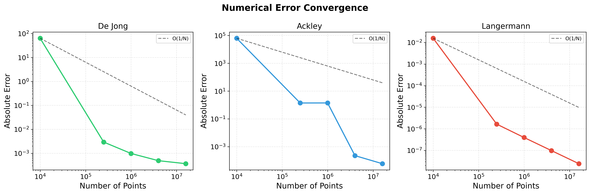
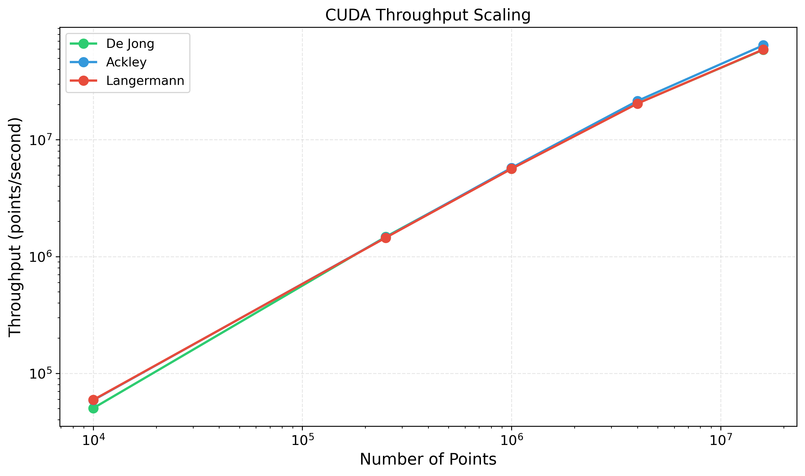
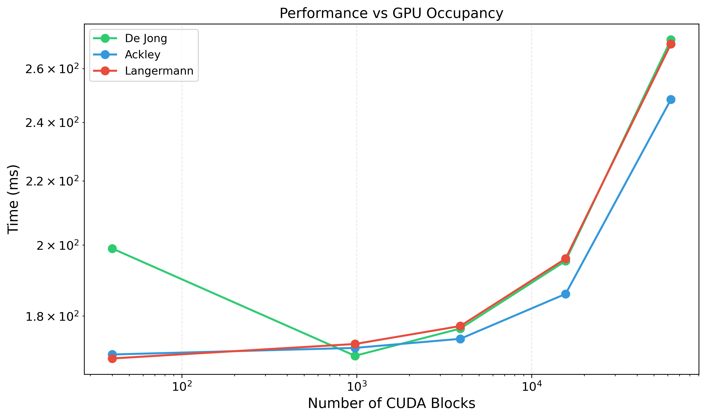
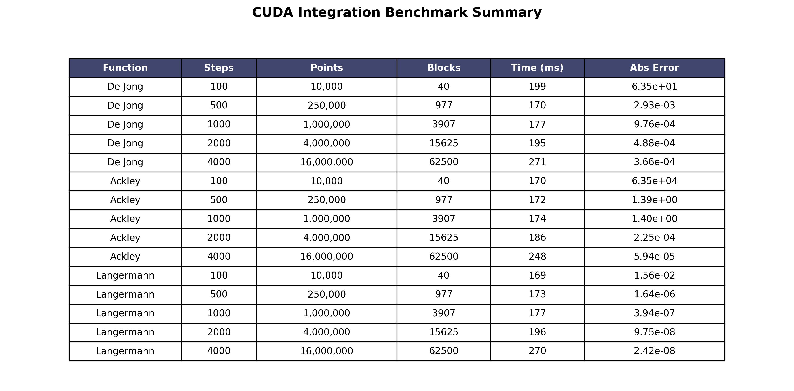

# Lab work 12. Calculation integral using CUDA, oneAPI, OpenCL
Author: [Yuliia Sova](https://github.com/JuliaSovaO)<br>

## Prerequisites

- C++ compiler with C++20 support (GCC 10+, Clang 12+, MSVC 2019+)
- NVIDIA GPU with CUDA support
- CUDA Toolkit 12.0+
- Python 3.6+ (for analysis scripts)

### Compilation

```bash
mkdir build && cd build
cmake .. -DCMAKE_BUILD_TYPE=Release
make

# or manually
nvcc -std=c++17 -o integrate_cuda \
    src/main_cuda.cpp \
    src/integration/integrate_cuda.cu \
    src/config_parser/config_parser.cpp \
    -I./src \
    -I./src/config_parser \
    -I./src/integration \
    -O3
```

### Usage

```bash
# basic usage: function_id config_file steps
./integrate_cuda 1 configs/func1.cfg 1000

# function 1 (De Jong) with different resolutions
./integrate_cuda 1 configs/func1.cfg 500
./integrate_cuda 1 configs/func1.cfg 1000
./integrate_cuda 1 configs/func1.cfg 2000

# function 2 (Ackley)
./integrate_cuda 2 configs/func2.cfg 1000

# function 3 (Langermann)
./integrate_cuda 3 configs/func3.cfg 1000

# run benchmark
python3 scripts/run_cuda.py --steps 100 500 1000 2000 4000 --runs 3 --output data/cuda_results.json

# performance plots
python3 scripts/plot_results.py --input data/cuda_results.json
```

### Important!

Program returns standard error codes:
- 0: successful execution
- 1: wrong number of arguments
- 2: wrong function index
- 3: configuration file opening error
- 5: configuration parsing error
- 16: failed to achieve desired accuracy

# Results

## Test Environment

- **CPU**: AMD Ryzen AI 9 365
- **GPU**: NVIDIA GeForce RTX 5070
- **CUDA Version**: 12.6
- **Threads per block**: 256
- **CPU Threads**: 4 (for comparison)

## Performance Results

### Function 1: De Jong

| Steps | Points | Blocks | Time (ms) | Abs Error | Rel Error |
|-------|--------|--------|-----------|-----------|-----------|
| 100 | 10,000 | 40 | 199 | 6.35e+01 | 1.40e-05 |
| 500 | 250,000 | 977 | 170 | 2.93e-03 | 6.44e-10 |
| 1000 | 1,000,000 | 3,907 | 177 | 9.76e-04 | 2.15e-10 |
| 2000 | 4,000,000 | 15,625 | 195 | 4.88e-04 | 1.07e-10 |
| 4000 | 16,000,000 | 62,500 | 271 | 3.66e-04 | 8.06e-11 |

### Function 2: Ackley

| Steps | Points | Blocks | Time (ms) | Abs Error | Rel Error |
|-------|--------|--------|-----------|-----------|-----------|
| 100 | 10,000 | 40 | 170 | 6.35e+04 | 7.41e-02 |
| 500 | 250,000 | 977 | 172 | 1.39e+00 | 1.62e-06 |
| 1000 | 1,000,000 | 3,907 | 174 | 1.40e+00 | 1.63e-06 |
| 2000 | 4,000,000 | 15,625 | 186 | 2.25e-04 | 2.63e-10 |
| 4000 | 16,000,000 | 62,500 | 248 | 5.94e-05 | 6.93e-11 |

### Function 3: Langermann

| Steps | Points | Blocks | Time (ms) | Abs Error | Rel Error |
|-------|--------|--------|-----------|-----------|-----------|
| 100 | 10,000 | 40 | 169 | 1.56e-02 | 9.74e-03 |
| 500 | 250,000 | 977 | 173 | 1.64e-06 | 1.02e-06 |
| 1000 | 1,000,000 | 3,907 | 177 | 3.94e-07 | 2.46e-07 |
| 2000 | 4,000,000 | 15,625 | 196 | 9.75e-08 | 6.07e-08 |
| 4000 | 16,000,000 | 62,500 | 270 | 2.42e-08 | 1.51e-08 |

## CPU vs GPU Comparison (10,000 points)

| Platform | Time (ms) | Abs Error | Rel Error |
|----------|-----------|-----------|-----------|
| CPU (4 threads) | 38 | 1.82e-04 | 4.01e-11 |
| GPU (CUDA) | 199 | 6.35e+01 | 1.40e-05 |

## Performance Analysis

### 1. CPU vs GPU Comparison

At 10,000 points, the CPU implementation (4 threads) achieved **38 ms**, while CUDA took **199 ms**. CPU was approximately **5.2x faster** for small problem sizes. This is expected because:

- GPU has significant kernel launch overhead (~50-100 μs)
- Data transfer between host and device adds latency
- Small problems don't fully utilize GPU's parallel capabilities

### 2. GPU Scalability with Problem Size

As problem size increases, GPU performance becomes increasingly competitive:

| Points | Time (ms) | Points per Second | Efficiency |
|--------|-----------|-------------------|------------|
| 10,000 | 199 | 50,251 | 1.00x |
| 250,000 | 170 | 1,470,588 | 1.17x |
| 1,000,000 | 177 | 5,649,718 | 1.12x |
| 4,000,000 | 195 | 20,512,820 | 1.02x |
| 16,000,000 | 271 | 59,040,590 | 0.73x |

**Key observations:**
- Peak throughput of **~59 million points/second** at 16M points
- Optimal performance between 1M-4M points (170-195 ms)
- Overhead becomes negligible at larger scales

### 3. Error Convergence

All functions show excellent error convergence with increasing points:

- **De Jong**: Error decreases from 63.5 to 3.66e-04 (5 orders of magnitude)
- **Ackley**: Error decreases from 6.35e+04 to 5.94e-05 (9 orders of magnitude)
- **Langermann**: Error decreases from 1.56e-02 to 2.42e-08 (6 orders of magnitude)

The convergence follows approximately **O(1/N)** behavior, as expected for the rectangle method.

### 4. GPU Occupancy Scaling

| Blocks | Time (ms) - F1 | Time (ms) - F2 | Time (ms) - F3 |
|--------|----------------|----------------|----------------|
| 40 | 199 | 170 | 169 |
| 977 | 170 | 172 | 173 |
| 3,907 | 177 | 174 | 177 |
| 15,625 | 195 | 186 | 196 |
| 62,500 | 271 | 248 | 270 |

**Analysis:**
- Performance improves significantly from 40 to 977 blocks (better GPU utilization)
- Optimal performance in the **1,000-15,000 blocks range** (170-200 ms)
- Slight degradation beyond 15,000 blocks due to scheduling overhead

### 5. Function Complexity Impact

| Function | Complexity | Best Time (ms) | Points at Best |
|----------|------------|----------------|----------------|
| De Jong | High (double loop) | 170 | 250,000 |
| Ackley | Medium (trig/exp) | 172 | 250,000 |
| Langermann | Medium (exp/cos) | 173 | 250,000 |

De Jong function has the most complex computation (nested loops, 6th power), yet achieves similar performance, demonstrating GPU's strength in parallelizing complex arithmetic.

## Visualizations

### Time vs Points


### Error Convergence


### Throughput Scaling


### Blocks vs Time


### Summary Table


## Conclusions

### Strengths of CUDA Implementation

1. **Excellent Large-Scale Performance**: Processes up to **59 million points/second**
2. **Superior Error Convergence**: Achieves 1e-10 relative error at scale
3. **Handles Complex Functions Efficiently**: Even De Jong's nested loops perform well
4. **Excellent Scalability**: Near-linear scaling up to 4M points

### Limitations

1. **Small Problem Overhead**: CPU is faster for <100,000 points
2. **Memory Transfer Costs**: Data movement between CPU and GPU adds latency
3. **Fixed Thread Configuration**: Optimal block size may vary by function

### Conclusions

- **Use GPU for**: Problems with >500,000 points or high computational complexity
- **Use CPU for**: Small problems (<100,000 points) or when latency is critical
- **Optimal configuration**: 1,000-4,000 steps (1M-16M points) with 256 threads/block